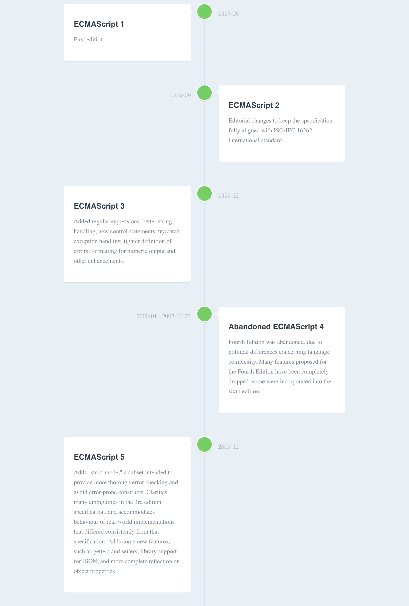

# mdline

[](LICENSE)
[](https://github.com/sponsors/JV-conseil "Become a sponsor to JV-conseil")
[](https://stackoverflow.com/users/2477854/jv-conseil "Follow JV conseil on StackOverflow")
[](https://twitter.com/JVconseil "Follow JVconseil on Twitter")
[](https://mastodon.social/@JVconseil "Follow JVconseil on Mastodon")
[](https://github.com/JV-conseil "Follow JV conseil on GitHub")

Markdown timeline format and toolkit.

For example, mdline convert [a markdown file](packages/mdline-parser/test/snapshots/ecmascript/input.md) to following [HTML file](https://mdline.netlify.com/).

[](https://mdline.netlify.com/)

> mdline timeline: <https://mdline.netlify.com/>
> [ECMAScript - Wikipedia](https://en.wikipedia.org/wiki/ECMAScript)

## Mdline Format

```bash
## {{Date}}: TITLE

MARKDOWN BODY

## {{Date}}--{{Date}}: TITLE

MARKDOWN BODY
```

**Example:**

```bash
## 1997-06: ECMAScript 1

First edition.

## 1998-06: ECMAScript 2

Editorial changes to keep the specification fully aligned with ISO/IEC 16262 international standard.

## 1999-12: ECMAScript 3

Added regular expressions, better string handling, new control statements, try/catch exception handling, tighter definition of errors, formatting for numeric output and other enhancements.

## 2000-01--2007-10-23: [Abandoned] ECMAScript 4

Fourth Edition was abandoned, due to political differences concerning language complexity. Many features proposed for the Fourth Edition have been completely dropped; some were incorporated into the sixth edition.
```

For more details, see [ECMAScript timeline markdown](packages/mdline/test/snapshots/example/input.md) and [HTML](packages/mdline/test/snapshots/example/output.html).

You can also live demo on <https://mdline.netlify.com/>.

## Usage

Install with [yarn](https://yarnpkg.com):

<!--
Install with [npm](https://www.npmjs.com/):~~

`npm install --global mdline`

-->

```bash
yarn add -D mdline@https://github.com/JV-conseil/mdline/tree/main/packages/mdline
yarn add -D mdline@JV-conseil/mdline#workspace=mdline
```

Convert mdline format text to html.

```bash
mdline ./timeline.md -o timeline.html
# or
npx mdline ./timeline.md -o timeline.html
```

For more details, see [mdline package](./packages/mdline).

## Packages

This repository is a monorepo includes following packages.

- [types](./packages/types) - Type definitions for mdline
- [mdline](./packages/mdline) - CLI, Core
- [mdline-parser](./packages/mdline-parser) - Parser for mdline format
- [mdline-formatter-html](./packages/mdline-formatter-html) - Formatter for mdline format

## Changelog

See [Releases page](https://github.com/JV-conseil/mdline/releases).

## Running tests

```bash
yarn install
# yarn bootstrap
yarn run lerna repair
yarn test
```

## Release workflow

```bash
# = npm version
yarn run versionup
# = npm publish
yarn run release
```

## Docker

You have a basic Docker integration in the `docker` directory with an example file.

- Build the image with `docker/build.sh`. A docker image named `mdline` will be created.
- Test the conversion with `docker/test.sh`. It will convert the `docker/example.md` file to HTML format.

## Contributing

Pull requests and stars are always welcome.

For bugs and feature requests, [please create an issue](https://github.com/JV-conseil/mdline/issues).

1. Fork it!
2. Create your feature branch: `git checkout -b my-new-feature`
3. Commit your changes: `git commit -am 'Add some feature'`
4. Push to the branch: `git push origin my-new-feature`
5. Submit a pull request :D

## Author

- [github/JV-conseil](https://github.com/JV-conseil)
- [twitter/JVconseil](https://twitter.com/JVconseil)

## License

License EUPL 1.2 @ JV-conseil
